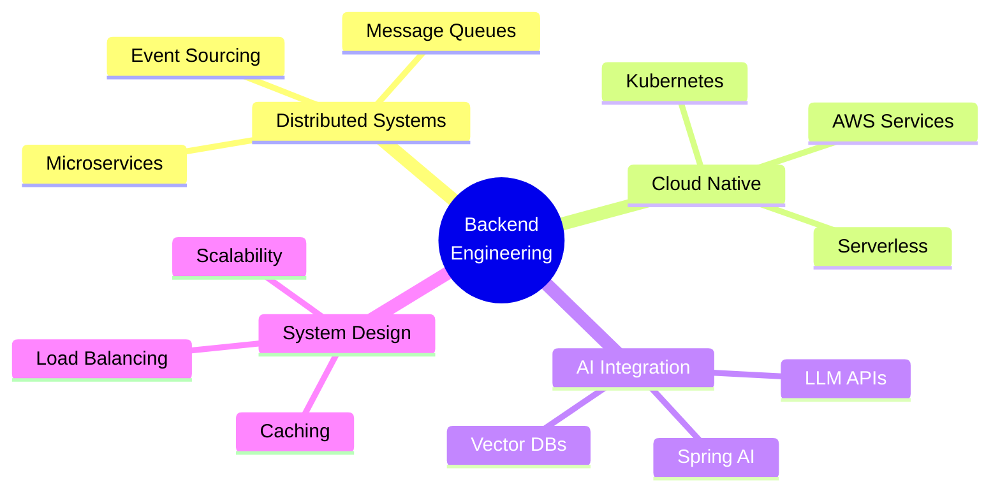

# Hey, I'm Sumeet Yadav 👨‍💻

<div align="center">

[](https://git.io/typing-svg)

**Crafting scalable backends & AI-powered solutions**

[](https://sumeetdev.netlify.app)
[](https://linkedin.com/in/sumeet-backenddev)
[](mailto:sumeety202@gmail.com)


</div>

---

## 🎯 What I'm Building

```java
public class SumeetYadav {
    private String role = "Backend Developer";
    private String[] currentFocus = {"Spring AI Integration", "Distributed Systems", "Cloud Architecture"};
    private String location = "Mumbai, India";
    
    public void code() {
        while (learning) {
            buildAPIs();
            optimizePerformance();
            deployToCloud();
        }
    }
}
```

🔭 **Currently:** Building AI-powered production services with Spring Boot & Groq API  
🌱 **Learning:** System Design, Kubernetes, Microservices Architecture  
⚡ **Recent:** Deployed e-commerce platform handling auth, payments & real-time inventory

---

## 🛠️ Tech Arsenal

<table>
<tr>
<td valign="top" width="50%">

### Backend & Core


</td>
<td valign="top" width="50%">

### Database & Cloud


</td>
</tr>
<tr>
<td valign="top" width="50%">

### Frontend & UI


</td>
<td valign="top" width="50%">

### Tools & Workflow


</td>
</tr>
</table>

---

## 🚀 Featured Projects

### 🤖 [ProdPulse.AI](https://prodpulse-ai-1.onrender.com) - AI Error Analysis Engine
> Production-grade AI service analyzing error logs with LLaMA 3.3-70B

```
🎯 Impact: Reduces debugging time by 60% with AI-powered insights
🔧 Tech: Spring Boot • Spring AI • Groq API • MySQL • REST API
✨ Features: Rate limiting, severity detection, historical tracking
```

**Highlights:** IP-based rate limiting • Automatic severity classification • Sub-2s response times

---

### 🛍️ [AureumPicks](https://aureumpicks.up.railway.app) - Enterprise E-Commerce
> Full-stack e-commerce with enterprise security & premium UX

```
🔐 Security: JWT auth, BCrypt encryption, role-based access
💳 Features: Cart management, OTP verification, payment integration
🎨 Design: Day/night themes, responsive layout, modern UI
```

**Highlights:** Spring Security • Brevo Email API • CORS-configured • Railway deployment

---

### 💼 [Portfolio](https://sumeetdev.netlify.app) - 3D Interactive Experience
> Modern portfolio with Three.js particle system & glassmorphism

```
🎮 3D: Interactive particle system with mouse tracking
🎨 Design: Glassmorphism, gradient animations, smooth scrolling
⚡ Performance: Vanilla JS, optimized rendering, CDN delivery
```

**Highlights:** Three.js integration • Custom CSS effects • Netlify CI/CD

---

## 📊 GitHub Stats

<div align="center">


</div>

<div align="center">

[](https://git.io/streak-stats)

</div>

---

## 🎓 Current Focus Areas



---

## 📝 Latest Blog Posts
<!-- BLOG-POST-LIST:START -->
- Coming soon: Building Production-Ready Spring Boot APIs
- Coming soon: JWT Authentication Deep Dive
- Coming soon: Integrating AI into Spring Boot Applications
<!-- BLOG-POST-LIST:END -->

---

## 🏆 Achievements

- 🎯 Built & deployed 3 production applications
- 🔐 Implemented enterprise-grade authentication systems
- 🤖 Integrated AI/ML models into Spring Boot services
- ☁️ Deployed scalable applications on AWS & Railway
- 📚 Mastered Spring ecosystem (Boot, Security, Data JPA, AI)

---

## 💡 Philosophy

> *"Great backends are invisible. They just work—fast, secure, and reliable."*

**I believe in:**
- 📐 Clean architecture over quick hacks
- 🔒 Security by design, not as an afterthought
- 📈 Scalability from day one
- 🧪 Testing everything that can break
- 📖 Documentation that actually helps

---

## 📫 Let's Connect

I'm always open to interesting conversations about backend architecture, cloud computing, or collaborating on cool projects!

<div align="center">

**Drop me a line:**

[](https://linkedin.com/in/sumeet-backenddev)
[](mailto:sumeety202@gmail.com)
[](https://sumeetdev.netlify.app)

---

<sub>💻 Built with ❤️ by Sumeet Yadav | Last updated: January 2026</sub>

</div>
