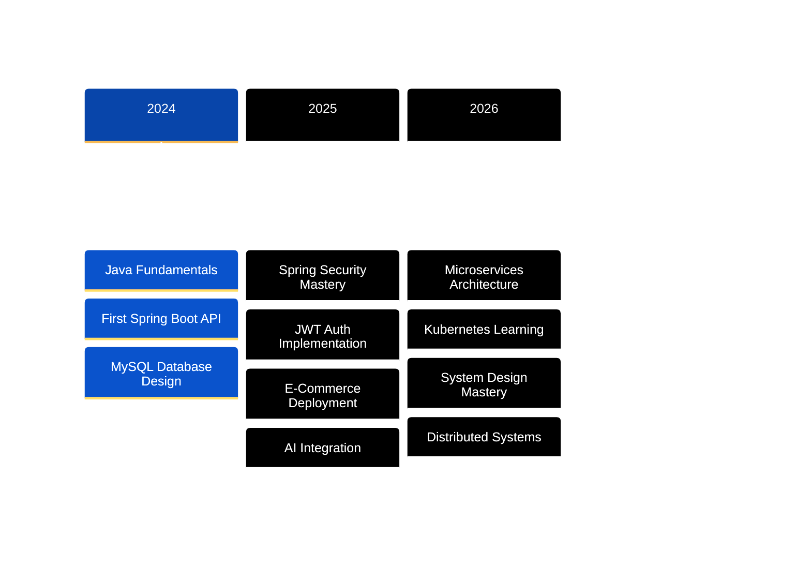

<div align="center">

#  HEY THERE, I'M SUMEET YADAV


### Backend Developer | Cloud Architect | AI Integration Specialist

[](https://sumeetdev.netlify.app)
[](https://linkedin.com/in/sumeet-backenddev)
[](mailto:sumeety202@gmail.com)


</div>

---

##  About Me


```javascript
const sumeet = {
    location: "Mumbai, India 🇮🇳",
    role: "Backend Engineer",
    education: "B.Tech IT @ SIES",
    currentFocus: "AI-Powered APIs",
    
    techStack: {
        backend: ["Java", "Spring Boot", "Spring Security"],
        databases: ["MySQL", "JPA", "Hibernate"],
        cloud: ["AWS", "Docker", "Nginx"],
        ai: ["Spring AI", "Groq API", "LLaMA 3.3"]
    },
    
    currentlyLearning: ["Kubernetes", "Microservices", "System Design"],
    
    funFact: "I turn coffee into code ☕ → 💻"
};
```

<br clear="right"/>

---

##  What I'm Up To

<table>
<tr>
<td align="center" width="33%">
<br>
<b>🔥 Current Project</b><br>
ProdPulse.AI - AI Error Analysis<br>
<sub>Building with Spring AI & LLaMA</sub>
</td>
<td align="center" width="33%">
<br>
<b>📚 Learning</b><br>
Kubernetes & Microservices<br>
<sub>Container orchestration mastery</sub>
</td>
<td align="center" width="33%">
<br>
<b>🎯 2026 Goal</b><br>
System Design Expert<br>
<sub>Architect scalable systems</sub>
</td>
</tr>
</table>

---

##  Tech Stack

<div align="center">

### Backend & Core


### Database & Cloud


### Frontend


### Tools & Workflow


</div>

---

##  Featured Projects

<details open>
<summary><b>🤖 ProdPulse.AI - AI-Powered Error Analysis Engine</b></summary>

<br>

<div align="center">


[](https://prodpulse-ai-1.onrender.com)

</div>

**🎯 The Problem:** Engineers waste hours analyzing cryptic production errors

**💡 The Solution:** AI analyzes logs in seconds using LLaMA 3.3-70B

**📊 The Impact:**
- ⚡ 60% faster debugging time
- 🎯 Automatic severity detection
- 📈 Historical error tracking
- 🛡️ IP-based rate limiting

**🛠️ Tech Stack:**
- Spring Boot + Spring AI
- Groq API (LLaMA 3.3-70B)
- MySQL Database
- RESTful API Design

**✨ Key Features:**
- 🧠 Advanced AI error interpretation
- 🔒 Secure REST endpoints
- 📊 Historical analysis tracking
- ⚡ Sub-2 second response time

</details>

<details open>
<summary><b>🛍️ AureumPicks - Enterprise E-Commerce Platform</b></summary>

<br>

<div align="center">


[](https://aureumpicks.up.railway.app)

</div>

**🛒 Full-featured shopping platform with enterprise security**

**🔐 Security Features:**
- 🔑 JWT Authentication
- 📧 Email OTP Verification
- 🔒 BCrypt Password Encryption
- 👥 Role-Based Access Control
- 🛡️ CORS Configuration

**🛠️ Tech Stack:**
- Spring Boot + Spring Security
- MySQL Database
- Brevo Email API
- Railway Deployment

**✨ Features:**
- 🛒 Complete cart management
- 💳 Secure payment integration
- 🎨 Premium UI with day/night themes
- 📱 Fully responsive design

</details>

<details>
<summary><b>💼 Interactive 3D Portfolio</b></summary>

<br>

<div align="center">


[](https://sumeetdev.netlify.app)

</div>

**🎮 Modern portfolio with 3D particle system**

**🛠️ Tech Stack:**
- Three.js for 3D graphics
- Vanilla JavaScript
- Custom CSS animations
- Netlify hosting

**✨ Features:**
- 🎮 Interactive particle system with mouse tracking
- ✨ Glassmorphism design effects
- 🌈 Smooth gradient animations
- ⚡ Optimized performance

</details>

---

##  GitHub Stats

<div align="center">


</div>

---

##  GitHub Trophies

<div align="center">

[](https://github.com/ryo-ma/github-profile-trophy)

</div>

---

##  My Journey



---

##  2026 Learning Roadmap

<div align="center">

### Cloud Native Architecture


### Microservices & Patterns


### Message Queues & Streaming


### Advanced Databases


### AI & Machine Learning


</div>

---

##  Development Philosophy

<div align="center">

| 🎯 Principle | 💭 My Approach |
|:---:|:---|
| **Clean Code** | Write code that humans can read, not just machines |
| **Security First** | Never an afterthought, always designed from the start |
| **Scalability** | Build for tomorrow's traffic, not just today's |
| **Testing** | If it can break, it will break—test everything |
| **Documentation** | Future me will thank present me |

</div>

---

##  Fun Developer Stats

<div align="center">

<table>
<tr>
<td align="center" width="25%">

<h3>☕ Coffee</h3>
<b>∞ cups/day</b>
</td>
<td align="center" width="25%">

<h3>🐛 Bugs Fixed</h3>
<b>1000+ and counting</b>
</td>
<td align="center" width="25%">

<h3>🚀 Deployments</h3>
<b>10+ live projects</b>
</td>
<td align="center" width="25%">

<h3>💡 Best Code</h3>
<b>After midnight</b>
</td>
</tr>
</table>

</div>

---

##  Let's Connect

<div align="center">


### 🚀 Ready to collaborate on something amazing?

I'm always open to discussing backend architecture, cloud computing, AI integration,  
or collaborating on interesting projects!

<br>

[](https://linkedin.com/in/sumeet-backenddev)
[](mailto:sumeety202@gmail.com)
[](https://sumeetdev.netlify.app)
[](https://github.com/Sumeet-Y1)

<br>

### 💬 *"Great backends are invisible—they just work, fast and reliably"*

<br>


---

<sub>⚡ Built with passion by Sumeet Yadav | Last Updated: January 2026 | Powered by ☕ and 💙</sub>

</div>
