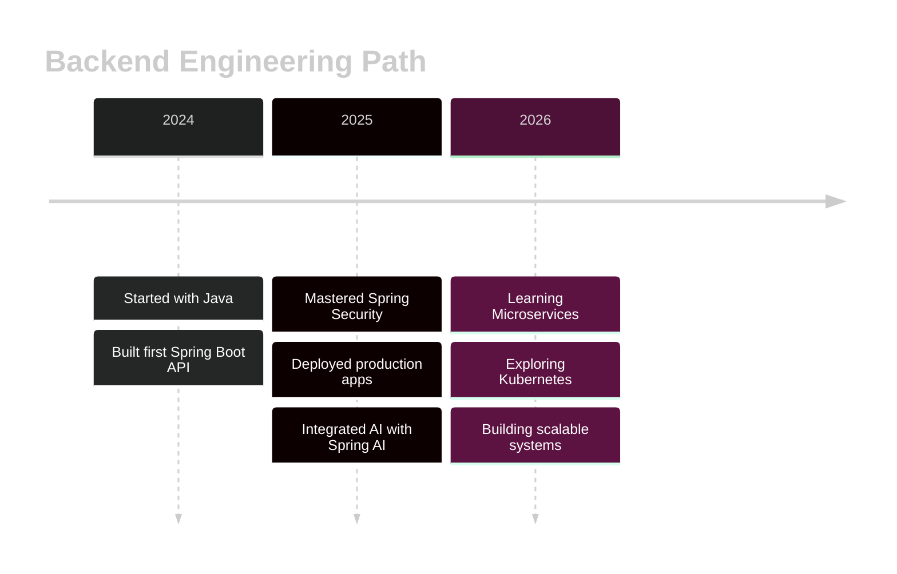
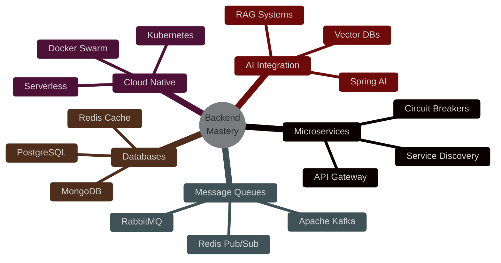

<div align="center">

# 👋 Welcome to My Digital Workspace


[](https://git.io/typing-svg)


### 🚀 Transforming Coffee ☕ into Production-Ready Code 💻

[](https://sumeetdev.netlify.app)
[](https://linkedin.com/in/sumeet-backenddev)
[](mailto:sumeety202@gmail.com)


</div>

---


### 👨‍💻 About Me

```javascript
const sumeet = {
    location: "Mumbai, India 🇮🇳",
    role: "Backend Engineer",
    code: ["Java", "JavaScript", "SQL"],
    technologies: {
        backend: ["Spring Boot", "Spring Security", "Spring AI"],
        databases: ["MySQL", "JPA/Hibernate"],
        cloud: ["AWS EC2", "Docker", "Nginx"],
        tools: ["Maven", "Git", "Postman", "IntelliJ"]
    },
    currentFocus: "Building AI-powered microservices",
    funFact: "I debug with console.log AND breakpoints 🎯"
};
```

<br clear="right"/>

---

<div align="center">

## 🎯 **What I'm Up To**

<table>
<tr>
<td align="center" width="33%">
<br>
<b>Current Project</b><br>
🤖 ProdPulse.AI<br>
<sub>AI Error Analysis</sub>
</td>
<td align="center" width="33%">
<br>
<b>Learning</b><br>
☸️ Kubernetes<br>
<sub>Container Orchestration</sub>
</td>
<td align="center" width="33%">
<br>
<b>Goal</b><br>
🎓 System Design Master<br>
<sub>Scalable Architecture</sub>
</td>
</tr>
</table>

</div>

---

## 💼 **Featured Projects**

<details open>
<summary><b>🤖 ProdPulse.AI - AI-Powered Error Intelligence</b></summary>
<br>

[](https://prodpulse-ai-1.onrender.com)

```
🎯 Problem: Engineers waste hours analyzing production errors
💡 Solution: AI analyzes logs in seconds with actionable insights
⚡ Impact: 60% faster debugging, automatic severity detection
```

**Tech Stack:**


**✨ Key Features:**
- 🧠 LLaMA 3.3-70B model integration
- 🛡️ IP-based rate limiting
- 📊 Historical error tracking
- ⚡ Sub-2 second response times
- 🎯 Automatic severity classification


</details>

<details open>
<summary><b>🛍️ AureumPicks - Enterprise E-Commerce Platform</b></summary>
<br>

[](https://aureumpicks.up.railway.app)

```
🛒 Full-featured shopping experience with enterprise security
🔐 JWT authentication + Email OTP verification
🎨 Premium UI with day/night themes
```

**Tech Stack:**


**✨ Key Features:**
- 🔒 BCrypt password encryption
- 📧 Brevo email integration
- 👥 Role-based access control (RBAC)
- 🛒 Real-time cart management
- 🌓 Theme switching system


</details>

<details>
<summary><b>💼 Interactive 3D Portfolio</b></summary>
<br>

[](https://sumeetdev.netlify.app)

```
🎮 3D particle system with mouse interaction
✨ Glassmorphism design with smooth animations
⚡ Vanilla JavaScript - no frameworks needed
```

**Tech Stack:**


</details>

---

## 🛠️ **Technology Arsenal**

<div align="center">

### **Backend & Core**


### **Database & ORM**


### **Cloud & DevOps**


### **Frontend**


### **Tools & Workflow**


</div>

---

## 📊 **GitHub Analytics**

<div align="center">


</div>

---

## 🏆 **GitHub Trophies**

<div align="center">

[](https://github.com/ryo-ma/github-profile-trophy)

</div>

---

## 🎯 **My Coding Journey**



---

## 💡 **Development Philosophy**

<div align="center">

| 🎯 Principle | 💭 Approach |
|:---:|:---|
| **Clean Code** | Write code humans can read, not just machines |
| **Security First** | Never an afterthought, always by design |
| **Scalability** | Build for tomorrow's traffic, not just today's |
| **Testing** | If it can break, it will—test everything |
| **Documentation** | Future you will thank present you |

</div>

---

## 📈 **Learning Roadmap**

<div align="center">



</div>

---

## 🎮 **Fun Stats**

<div align="center">

<table>
<tr>
<td align="center" width="25%">
<br>
<b>☕ Coffee Consumed</b><br>
<sub>∞ cups</sub>
</td>
<td align="center" width="25%">
<br>
<b>🐛 Bugs Fixed</b><br>
<sub>Too many to count</sub>
</td>
<td align="center" width="25%">
<br>
<b>🚀 Deployments</b><br>
<sub>10+ and counting</sub>
</td>
<td align="center" width="25%">
<br>
<b>💡 Late Night Ideas</b><br>
<sub>All of them</sub>
</td>
</tr>
</table>

</div>

---

## 🌟 **Featured Contributions**

<div align="center">

[](https://github.com/Sumeet-Y1)

</div>

---

## 📬 **Let's Build Something Amazing**

<div align="center">

I'm always excited to collaborate on interesting projects, discuss system architecture, or chat about the latest in backend tech!

[](https://linkedin.com/in/sumeet-backenddev)
[](mailto:sumeety202@gmail.com)
[](https://sumeetdev.netlify.app)
[](https://github.com/Sumeet-Y1)

### 💬 "Great APIs are invisible—they just work, fast and reliably"


---

<sub>⚡ Built with passion by Sumeet Yadav | Updated January 2026 | Made with 💙 and lots of ☕</sub>

</div>
