```mermaid
%%{init: {'theme':'dark', 'themeVariables': { 'primaryColor': '#6366f1', 'primaryTextColor': '#fff', 'primaryBorderColor': '#6366f1', 'lineColor': '#6366f1', 'secondaryColor': '#1e293b', 'tertiaryColor': '#0f172a'}}}%%
timeline
    title 🚀 Backend Engineering Evolution
    section 2024
        Started Journey : Java Fundamentals
                        : First Spring Boot API
                        : MySQL Database Design
    section 2025
        Production Ready : Spring Security Mastery
                         : JWT Authentication
                         : Deployed E-Commerce Platform
                         : AI Integration with Spring AI
    section 2026
        Scaling Up : Microservices Architecture
                   : Kubernetes Learning
                   : Distributed Systems
                   : System Design Mastery
```

<div align="center">


### 🎯 Building Scalable APIs • 🤖 Integrating AI • ☁️ Deploying to Cloud

<p align="center">
  <a href="https://sumeetdev.netlify.app" target="_blank">
    
  </a>
  <a href="https://linkedin.com/in/sumeet-backenddev" target="_blank">
    
  </a>
  <a href="mailto:sumeety202@gmail.com">
    
  </a>
</p>


<p align="center">
  
  
  
</p>

</div>


##  Connect & Collaborate

<div align="center">


### 🚀 Let's Build Something Amazing Together!

I'm always excited to collaborate on interesting projects, discuss system architecture,  
or chat about backend tech, cloud computing, and AI integration!

<br>

<a href="https://linkedin.com/in/sumeet-backenddev" target="_blank">
  
</a>
<a href="mailto:sumeety202@gmail.com">
  
</a>
<a href="https://sumeetdev.netlify.app" target="_blank">
  
</a>
<a href="https://github.com/Sumeet-Y1" target="_blank">
  
</a>

<br><br>

### 💬 "Great backends are invisible—they just work, fast and reliably"

<br>


<br>

<sub>⚡ Built with passion by Sumeet Yadav | Last Updated: January 2026 | Powered by ☕ and 💙</sub>

</div>

##  About Me


```javascript
class SumeetYadav extends BackendEngineer {
  constructor() {
    super();
    this.name = "Sumeet Yadav";
    this.location = "Mumbai, India 🇮🇳";
    this.role = "Backend Developer";
    this.education = "B.Tech IT @ SIES";
  }
  
  getCurrentlyWorking() {
    return [
      "🤖 Building ProdPulse.AI",
      "☸️ Learning Kubernetes",
      "📚 Mastering System Design"
    ];
  }
  
  getTechStack() {
    return {
      backend: ["Java", "Spring Boot", "Spring Security"],
      databases: ["MySQL", "JPA", "Hibernate"],
      cloud: ["AWS", "Docker", "Nginx"],
      ai: ["Spring AI", "Groq API", "LLaMA"]
    };
  }
  
  getDailyRoutine() {
    return ["☕ Coffee", "💻 Code", "🐛 Debug", "🚀 Deploy", "🔁 Repeat"];
  }
}
```

<br clear="right"/>


##  What I'm Doing Right Now

<div align="center">

<table>
<tr>
<td align="center" width="33%" style="border: none;">

<h3>🔥 Current Focus</h3>

<br><br>
<sub>Building production-grade AI service<br>with LLaMA 3.3 integration</sub>
</td>
<td align="center" width="33%" style="border: none;">

<h3>📚 Currently Learning</h3>

<br><br>
<sub>Container orchestration<br>and microservices</sub>
</td>
<td align="center" width="33%" style="border: none;">

<h3>🎯 2026 Goals</h3>

<br><br>
<sub>Architect scalable distributed<br>systems at enterprise scale</sub>
</td>
</tr>
</table>

</div>


##  Tech Stack & Tools

<div align="center">

<table>
<tr>
<td align="center" width="50%">

### 🎨 Backend & Core

<br><br>


</td>
<td align="center" width="50%">

### 💾 Database & ORM

<br><br>


</td>
</tr>
<tr>
<td align="center" width="50%">

### ☁️ Cloud & DevOps

<br><br>


</td>
<td align="center" width="50%">

### 🎨 Frontend


</td>
</tr>
<tr>
<td align="center" width="50%">

### 🛠️ Tools


</td>
<td align="center" width="50%">

### 🤖 AI & Integration


<br>


</td>
</tr>
</table>

</div>


##  Featured Projects

<details open>
<summary><b> 🤖 ProdPulse.AI - AI-Powered Error Intelligence</b></summary>

<div align="center">


[](https://prodpulse-ai-1.onrender.com)
[](https://github.com/Sumeet-Y1)

<br>

### 💡 The Problem
Engineers waste **hours** analyzing cryptic production errors, context switching between logs, and debugging issues manually.

### ✨ The Solution
**AI-powered error analysis** that delivers actionable insights in seconds using LLaMA 3.3-70B model.

### 📊 The Impact
```
⚡ 60% faster debugging
🎯 Automatic severity detection
📈 Historical error tracking
🛡️ Enterprise-grade rate limiting
```

<br>

### 🛠️ Tech Stack


### 🎯 Key Features
| Feature | Description |
|---------|-------------|
| 🧠 **AI Analysis** | LLaMA 3.3-70B model for intelligent error interpretation |
| 🛡️ **Rate Limiting** | IP-based throttling to prevent abuse |
| 📊 **Error Tracking** | Historical database of analyzed errors |
| ⚡ **Fast Response** | Sub-2 second analysis time |
| 🎯 **Severity Detection** | Automatic classification (Critical/High/Medium/Low) |
| 🔐 **Secure API** | CORS-enabled RESTful endpoints |

</div>


</details>

<details open>
<summary><b> 🛍️ AureumPicks - Enterprise E-Commerce Platform</b></summary>

<div align="center">


[](https://aureumpicks.up.railway.app)
[](https://github.com/Sumeet-Y1)

<br>

### 🛒 Full-Featured Shopping Experience
Production-ready e-commerce platform with **enterprise-level security** and modern UX design.

### 🔐 Security First
```
🔑 JWT Authentication
📧 Email OTP Verification
🔒 BCrypt Encryption
👥 Role-Based Access Control (RBAC)
🛡️ CORS Configuration
```

<br>

### 🛠️ Tech Stack


### ✨ Features
| Category | Features |
|----------|----------|
| 🔐 **Authentication** | JWT tokens, Email OTP, Password reset |
| 🛒 **Shopping** | Cart management, Product catalog, Inventory tracking |
| 💳 **Payments** | Secure checkout, Order processing |
| 🎨 **UI/UX** | Day/night themes, Responsive design, Modern interface |
| 👥 **User Management** | Role-based permissions, Profile management |
| 📧 **Notifications** | Brevo email integration, Order confirmations |

</div>


</details>

<details>
<summary><b> 💼 Interactive 3D Portfolio</b></summary>

<div align="center">


[](https://sumeetdev.netlify.app)

<br>

### 🎮 Interactive 3D Experience
Modern portfolio featuring **Three.js particle system** with mouse-responsive animations and glassmorphism design.

### 🛠️ Tech Stack


### 🎨 Features
- 🎮 **3D Particles** - Interactive particle system with mouse tracking
- ✨ **Glassmorphism** - Modern frosted glass UI effects
- 🌈 **Animations** - Smooth gradient transitions and scroll effects
- ⚡ **Performance** - Vanilla JS, optimized rendering
- 📱 **Responsive** - Works beautifully on all devices

</div>

</details>


##  GitHub Statistics

<div align="center">


</div>


##  GitHub Trophies

<div align="center">

[](https://github.com/ryo-ma/github-profile-trophy)

</div>


##  Learning Journey

<div align="center">



</div>


##  My Development Philosophy

<div align="center">

<table>
<tr>
<td align="center" width="20%">

<h4>🎯 Clean Code</h4>
<sub>Write for humans<br>not just machines</sub>
</td>
<td align="center" width="20%">

<h4>🔐 Security First</h4>
<sub>Never an afterthought<br>always by design</sub>
</td>
<td align="center" width="20%">

<h4>📈 Scalability</h4>
<sub>Build for tomorrow<br>not just today</sub>
</td>
<td align="center" width="20%">

<h4>🧪 Testing</h4>
<sub>If it can break<br>it will break</sub>
</td>
<td align="center" width="20%">

<h4>📖 Documentation</h4>
<sub>Future you will<br>thank present you</sub>
</td>
</tr>
</table>

</div>


##  Learning Roadmap 2026

<div align="center">


</div>


##  Fun Developer Stats

<div align="center">

<table>
<tr>
<td align="center" width="25%">

<h3>☕ Coffee Consumed</h3>

</td>
<td align="center" width="25%">

<h3>🐛 Bugs Squashed</h3>

</td>
<td align="center" width="25%">

<h3>🚀 Deployments</h3>

</td>
<td align="center" width="25%">

<h3>💡 Late Night Code</h3>

</td>
</tr>
</table>

</div>


##  Snake Eating My Contributions

<div align="center">

<picture>
  <source media="(prefers-color-scheme: dark)" srcset="https://raw.githubusercontent.com/Sumeet-Y1/Sumeet-Y1/output/github-contribution-grid-snake-dark.svg">
  <source media="(prefers-color-scheme: light)" srcset="https://raw.githubusercontent.com/Sumeet-Y1/Sumeet-Y1/output/github-contribution-grid-snake.svg">
  
</picture>

</div>

<img src="https://user-images.githubusercontent.
